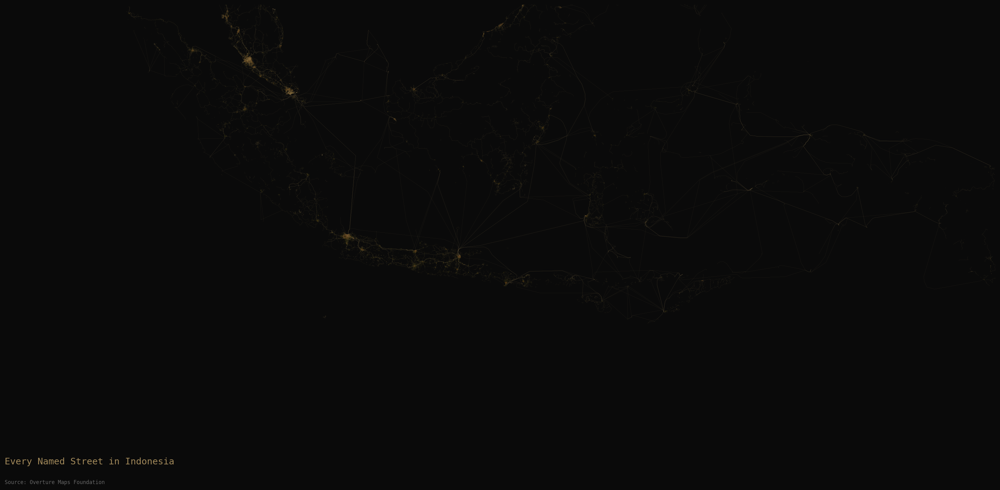

# Indonesia Street Names

A dataset of every named street in Indonesia, extracted from [Overture Maps](https://overturemaps.org/).

## Dataset

`indonesia_streets.parquet` (~20-30MB, zstd compressed) — columns:

- `street_name` — unique street name (deduplicated)
- `osm_way_id` — source OSM way ID number (where applicable)
- `source_dataset` — data source (e.g. OpenStreetMap)
- `geometry_wkt` — road geometry as WKT LineString

`sample.csv` — 100 rows preview, no geometry.

## Updating

Two independent workflows under **Actions**:
- **Extract Indonesia Street Names** — re-runs the full extraction, commits fresh parquet + sample
- **Generate Map** — regenerates `map.png` from the parquet (also auto-triggers after extract)

## Source

Overture Maps Foundation transportation/segment layer, release `2026-03-18.0`.  
License: [ODbL 1.0](https://opendatacommons.org/licenses/odbl/)

