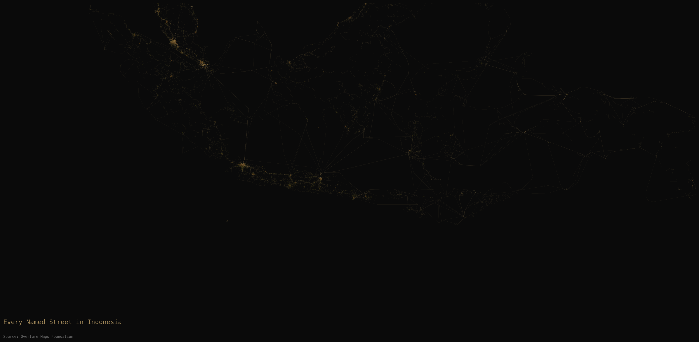

# Indonesia Street Names


A dataset of every uniquely named street in Indonesia, extracted from [Overture Maps](https://overturemaps.org/).



## Dataset

| File | Description |
|------|-------------|
| `data/indonesia_streets.parquet` | Full dataset, zstd compressed (~20-30MB) |
| `data/sample.csv` | 100-row preview, no geometry |

### Schema

| Column | Type | Description |
|--------|------|-------------|
| `street_name` | string | Unique street name |
| `osm_way_id` | string | Source OSM way ID |
| `source_dataset` | string | Data source (e.g. OpenStreetMap) |
| `geometry_wkt` | string | Road geometry as WKT LineString |

## Usage

```python
import duckdb

# Query directly — no download needed
df = duckdb.query("""
    SELECT street_name, osm_way_id
    FROM 'https://github.com/saikatkumardey/indonesia-street-names/raw/main/data/indonesia_streets.parquet'
    WHERE street_name ILIKE 'jalan sudirman%'
""").df()
```

## Updating

Workflows under **Actions**:

- **Extract Indonesia Street Names** — re-runs full extraction from Overture Maps, commits fresh parquet + sample
- **Generate Map** — regenerates `data/map.png` (also auto-triggers after extract)

## Source

Overture Maps Foundation, release `2026-03-18.0`, transportation/segment layer.
License: [ODbL 1.0](https://opendatacommons.org/licenses/odbl/)
